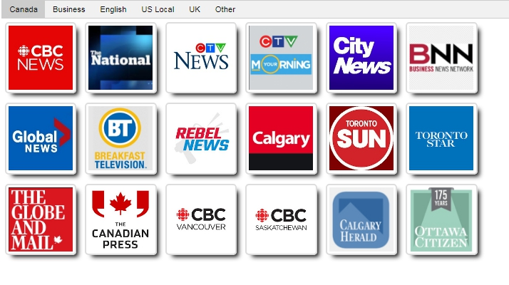
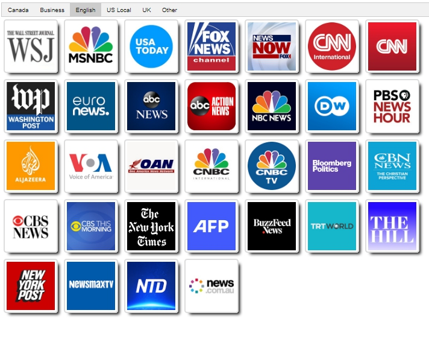
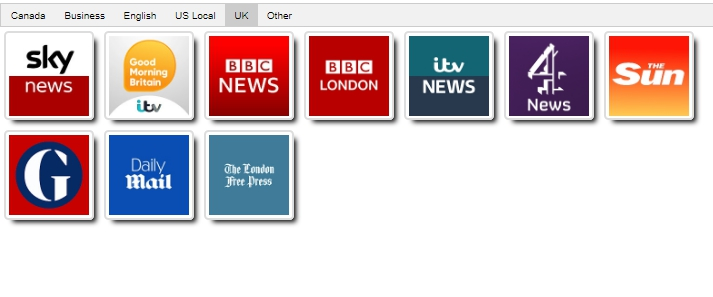

## News channels on youtube
A very simple script that generates a html page with links of youtube news channels. 

## How to run
Install latest version of Kotlin. At the folder with links.txt and icons folder, and runs
```
kotlin PageBuidler.kts
```
news_tube.html will be generated.

## How to edit
Add address on link.txt, If you want edit tabs, modify
```
<button class="tablinks" onclick="openCity(event, 'Canada')">Canada</button>
```


## Screen shot




